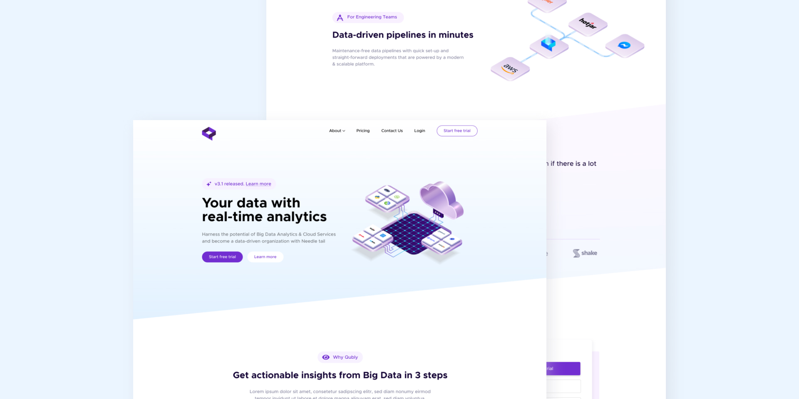

# Quibly - A Conceptual Company Landing Page

Quibly is a front-end project that showcases a conceptual company's landing page. It's inspired by a design from Rahul Rao and brought to life with modern web technologies. This project is not associated with any real company but serves as a demonstration of front-end development skills and design implementation.

## Table of Contents

- [Overview](#overview)
    - [Screenshot](#screenshot)
    - [Links](#links)
    - [Technologies Used](#technologies-used)
    - [Features](#features)
- [Setup](#setup)
- [Contact](#contact)
- [Acknowledgements](#acknowledgements)

## Overview

Quibly's landing page is built with React and features smooth scrolling effects, interactive components, and a modern design aesthetic. The page is fully responsive, ensuring a seamless experience across various devices and screen sizes.

### Screenshot



### Links

- [Project Repository](https://github.com/vaqueraoscar0/Quibly)
- [Live Demo](https://65f5e730db1002eeb489903f--adorable-belekoy-3970b9.netlify.app/)

### Technologies Used

This project was created using the following technologies:

- React 18.2
- Framer Motion 11.0.8
- GSAP 3.12.5
- Lenis for smooth scrolling
- TailwindCSS for styling
- Vite as the build tool
- TypeScript for type safety

### Features

Quibly's landing page includes the following features:

- Responsive design for a great experience on any device
- Smooth scrolling and animation effects for an engaging user interaction
- Interactive components like modals, carousels, and hover effects
- Integration of a variety of modern front-end development tools and libraries

## Setup

To run this project locally, you'll need Node.js and npm installed on your computer. After cloning the repository, install the dependencies and start the local server:

```bash
# Clone the repository
git clone https://github.com/vaqueraoscar0/Quibly.git

# Navigate to the project directory
cd Quibly

# Install dependencies
npm install

# Start the development server
npm run dev
